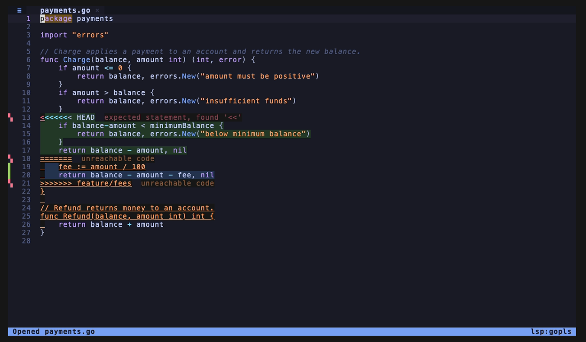
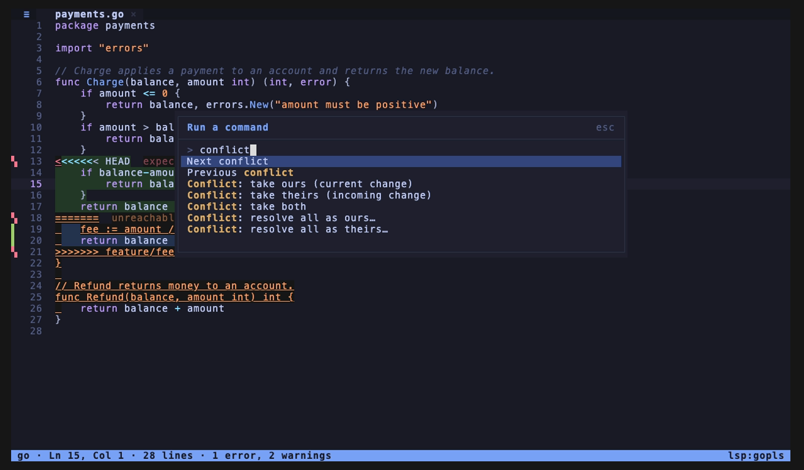
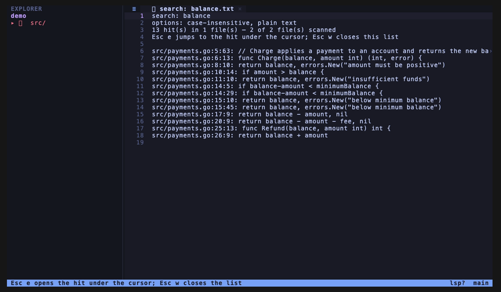
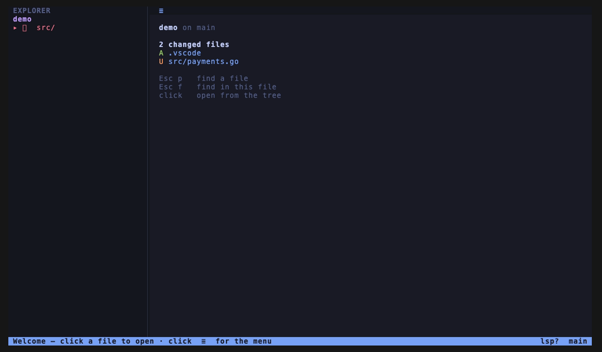
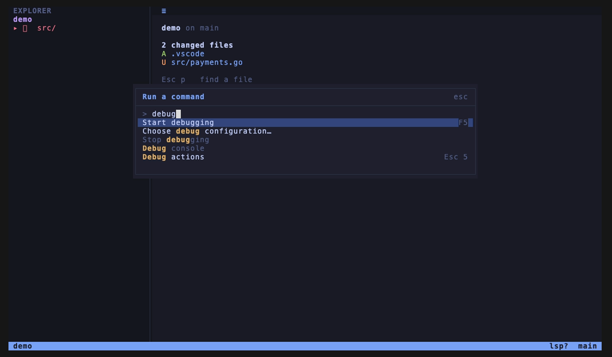

<!--
  File: README.md
  Copyright: 2026 Cloudmanic, LLC. (upstream) / 2026 Vonzelle Brown (fork)
-->

<p align="center">
  <picture>
    <source srcset="docs/assets/banner.webp" type="image/webp">
    
  </picture>
</p>

# herdr-edit

> A mouse-first terminal code editor **with real language intelligence** — inline diagnostics,
> hover, and go-to-definition — built to sit beside an AI agent in a [herdr](https://herdr.dev) pane.

Built on [**cloudmanic/spice-edit**](https://github.com/cloudmanic/spice-edit) by
[Spicer Matthews](https://github.com/cloudmanic) — a genuinely good editor, and the foundation this
stands on. That base gives us the buffer, the renderer, the mouse UI and the event loop; the fork adds
the language intelligence and the responsive layout on top. See
[What's new in this fork](#whats-new-in-this-fork) for exactly which parts are which.

This is the editor half of a two-part stack. The other half is
[**herdr-extensions**](https://github.com/vonzelle-vzt/herdr-extensions) — original work, no upstream —
which turns a herdr session into an IDE: 15 panels, the layout, the keybindings, a live app
preview, screenshot paste, and the installer that puts this editor in place.

```
herdr-extensions   the IDE: panels, layout, install    (100% original)
herdr-edit         the editor those panels drive       ← you are here
                   ├─ internal/lsp     language intelligence   (new here)
                   └─ core editor      buffer, render, mouse    (from spice-edit)
```

Either can be used without the other: the extension falls back to upstream `spiceedit`, and this
editor runs standalone on any terminal.

---

## What it looks like

<p align="center">
  
</p>

Recorded with [VHS](https://github.com/charmbracelet/vhs) against a real `gopls` — the diagnostic
is genuine, not a mock. Below is the same editor dumped from its own renderer:

Rendered by the editor itself, not drawn by hand — file tree, gutter, syntax, and an LSP
diagnostic reported inline at the end of the offending line:

```
 EXPLORER                    │  ≡    routes.go ×
 001                         │    1  package api
 ▾ src/                      │    2
   ▾ api/                    │    3  import "net/http"
       routes.go             │    4
   go.mod                    │    5  // Health reports service liveness.
   README.md                 │    6  func Health(w http.ResponseWriter, r *http.Request) {
                             │    7      w.WriteHeader(http.StatusOK)
                             │    8      w.Write([]byte(healthz)) undefined: healthz
                             │    9  }
                             │   10
                             │   11  func Register(mux *http.ServeMux) {
                             │   12      mux.HandleFunc("/healthz", Health)
                             │   13  }
                             │   14
                             │
                             │
                             │
                             │
                             │
                             │
                             │
                             │
                             │
                             │
 Opened routes.go
```

### Real captures

<p align="center">
  
</p>

Not a mock: `gopls` is running against the file *while it is mid-conflict* and is already flagging
the raw conflict markers as a syntax error, inline, at the exact column.

<p align="center">
  
</p>

`Esc k`, type `conflict` — every resolution action is a palette entry, not a chord you have to
remember.

<p align="center">
  
</p>

The results list is itself a jumpable source — `Esc e` on any row opens that file at that line.

<p align="center">
  
</p>

The tree marks the conflicted file `U` from the start page, before you have opened it.

<p align="center">
  
</p>

Debugging surfaces through the same palette as everything else — `F5` starts the remembered
configuration, and the picker is one entry away.

## Why this fork exists

Everything a VS Code user misses in a terminal is a shell command away — file tree, git, search,
formatting, preview — **except one thing**. Squiggles under the actual mistake need a live process
that has parsed your project. You cannot grep your way to "this identifier does not exist".

So this fork's headline is an **LSP client**. It is hand-rolled against the Go standard library, adds
no third-party dependencies, and is verified against real language servers:

```
$ herdr-edit main.go        # with gopls installed
  line 4 col 2  [UndeclaredName] error: undefined: undefinedThing
```

Notably, that is ground nobody else has claimed. herdr's plugin marketplace has 150+ entries and
none ships language intelligence; even Orca — the closest commercial competitor, at 32k+ stars —
embeds standalone Monaco with no LSP at all.

---

## What this fork adds

| Feature | Why it is here |
| --- | --- |
| **LSP diagnostics** — inline underlines, severity colours, message + code in the status bar, and the **message itself rendered dimmed at end-of-line** the way VS Code's Error Lens does | The one thing a terminal editor genuinely cannot fake. An underline tells you *where*; the inline message tells you *what*, without moving the cursor to read a status bar. Only the most severe diagnostic on a line draws, and it truncates rather than wrapping — a two-word fragment of an error is worse than no error. |
| **Hover and go-to-definition** | The other two things you reach for constantly. |
| **A file tree that respects `.gitignore`** | Upstream's *fuzzy finder* already honoured it; only the tree did not, so it listed `node_modules/`, `.next/`, `dist/`. On a real Next.js checkout that is **7 of 29** top-level entries. |
| **Find and *replace*** | Upstream find is case-insensitive substring **jump only** — there was no replace at all. `Esc f` opens the bar; `Tab`, the `›` chevron, or the menu's *Replace in file* expands the replace row. `Alt+c` / `Alt+w` / `Alt+r` toggle case, whole-word and regex — or click `Aa` `ab` `.*`. Enter replaces and advances; Shift+Enter replaces every match **as one undo step**. A pattern that will not compile says so, instead of reporting "no results". |
| **Auto-closing brackets and quotes** | Pairs close, closers step over, backspace removes both, and a selection gets *surrounded*. Quotes are suppressed after a word character so `don't` never becomes `don''t`. |
| **A start page** | With no tab open, the pane showed two lines of grey text. It now shows the project, branch, and changed files — each clickable. |
| **Word wrap** | Upstream has none. `Esc z` reflows long lines to the pane width, breaking on word boundaries, and re-wraps whenever the pane resizes. Off by default, per tab, like VS Code. |
| **A layout that degrades instead of refusing** | Below 50×24 upstream shows *"Window too small — please resize"*. Since the tree is a fixed 30 columns, a side panel was only usable in a narrow band. The tree now **auto-fits**: it grows to show full folder names and narrows toward 18 columns as the pane tightens, hiding only below 42 — a 60-column panel beside an agent still shows files. A splitter drag pins it. Floors drop to **24×8**. |
| **LSP autocomplete** | `textDocument/completion` with a popup under the cursor. Explicitly invoked with `Esc SPACE` (VS Code's Ctrl+Space) rather than firing as you type: an as-you-type popup needs a debounce, a cancellation story and a dismissal rule, and every one of those failure modes shows up as the editor swallowing a keystroke. Only the four keys the popup owns are consumed; anything else dismisses it and is handled normally. |
| **A command palette** | `Esc k`. Fuzzy search over every action, built from the action menu rather than from a list of its own — a second list is a second thing to forget to update. Scored with the same matcher as the file finder, because two notions of "fuzzy" in one program is a bug the user experiences as inconsistency. |
| **Inline git blame** | `Esc b`. Author, coarse relative age and subject, dimmed at end-of-line. Only the cursor's line is blamed — `git blame` on a whole file is linear in history and would run on every scroll. Diagnostics win the end of the line when both want it. |
| **Go to line, select all** | `Esc g`, `Esc a`. `SelectAll` had been complete and unit-tested in `internal/editor` with **zero** non-test callers; only the wiring was missing. |
| **`--open-at`, the reverse contract** | `herdr-edit --open-at path:line[:col]` asks an **already-running** editor to jump there. `active.json` flows editor → panels; this flows panels → editor, which is what turns a read-only review into an edit: the Review panel hands you a line from the agent's diff and you land on it with a language server attached. |
| **Merge-conflict detection and resolution** | A conflicted file opens with the `ours` and `theirs` bodies tinted, conflict-marker gutter glyphs, and the language server still running *through* the markers — so a syntax error inside a half-resolved conflict is flagged the same as anywhere else. Seven resolution actions (take ours, take theirs, take both, …) are reachable from the `≡` menu and the command palette; the file tree marks a conflicted file `U` before you have opened it. |
| **A diff view** | `Esc o` opens the active file's diff as a real tab, and pressing it again flips the baseline between your branch's **merge-base** and **HEAD** — "what does this branch change" versus "what have I not committed", which are different questions and the first is the one you ask of an agent's work. Built as a *synthetic tab* rather than a new render mode: word wrap already taught this codebase what a second geometry path costs, so a tab whose buffer happens to hold diff text inherits scrolling, search, selection and mouse hit-testing for free, and refuses to save. |
| **Rename and find-references** | `Esc y` renames a symbol project-wide; `Esc j` lists every use. Rename decodes **both** WorkspaceEdit wire shapes — servers send either `changes` or `documentChanges`, and handling one makes rename silently do nothing against half of them. Edits apply back-to-front per file, because changing text length at one position invalidates every position after it. |
| **Bookmarks** | `Esc m` pins a `file:line`, `Esc '` cycles them. A 401-repo sweep of herdr's marketplace found **no plugin that bookmarks a place in the code** — the "harpoon" ports mark panes and workspaces, which is navigation between windows, not between lines. |
| **The outline, fixes and signature help** | `Esc i` lists the file's symbols, `Esc l` offers code actions, and signature help folds into `Esc h` — it has no separate moment, since you want it while the cursor is inside a call, which is when you would reach for hover anyway. Both pickers reuse the command palette rather than adding a third list widget. Code actions that answer with a *command* rather than edits are dropped: running one needs `workspace/executeCommand`, and offering it would be a menu entry that silently does nothing. |
| **Cursor selection on a diff** | `Esc e` on any row of a diff jumps to that line in the real file. Deleted lines map to where they were removed from. The arithmetic honours the fact that a `-` line exists only in the old file and must not advance the new-file counter — counting rows instead drifts by one per deletion, which is invisible on a small diff and wrong by dozens on a real one. |
| **Search across the whole project** | `Esc F` (the shifted `Esc f`, as VS Code's Ctrl+Shift+F shifts Ctrl+F). Matching goes through the **find bar's own engine**, not ripgrep — rg never resolves under launchd's PATH so it would work in a terminal and vanish in a herdr pane; its `--column` is a 1-indexed *byte* offset where the buffer is rune-indexed and LSP counts UTF-16, three coordinate systems that agree on ASCII and diverge on the first emoji; and its Rust-regex dialect is not RE2, which would make "my pattern worked in the file but not the repo" unanswerable. A pattern that will not compile says so rather than reporting no results. |
| **A problems list you can walk** | `Esc ;` lists every reported diagnostic; `Esc .` / `Esc ,` and **F8 / Shift+F8** step through them, wrapping. The header says *problems the language servers have reported*, not "problems in the workspace" — a server only publishes for documents it knows about, and a list that silently omits half a repo is experienced as broken. Traversal reads diagnostics live while the list tab is a snapshot: a list that reorders under the cursor while you read it is worse than a stale one. |
| **Go to symbol in workspace** | `Esc I`, the workspace-wide sibling of `Esc i`. The one request that cannot resolve a single server from a file path, so it fans out to every running server and merges. Servers start lazily on the first file of a matching language, so before you open one the fan-out would return nothing — indistinguishable from "your symbol does not exist" — and the editor now says so instead of showing an empty picker. |
| **Jump from any generated list** | `Esc e` opens whatever `path:line:col` the cursor is sitting on, in a diff, a references list, a search result or a problems list. Find-references used to print exactly such a list and then tell you to press a key that takes no line number, so the `:line:col` was decorative. A feature that produces a list needs a test that *consumes* it the way a user would. |
| **Document highlight** | Other occurrences of the symbol under the cursor tint as you move, the way VS Code does constantly. Suppressed on wrapped tabs, during a selection and while the find bar is open, and memoized — `draw()` repaints on every event including mouse motion. |
| **Breakpoints that follow your edits** | `Esc 9` toggles one, `Esc 5` lists them; they persist across sessions and export as `break file:line` for dlv, pdb or gdb. Insert a line above a breakpoint and it moves down with it; delete its lines and it dies. That tracking is why the debugger belongs *inside* the editor — an external process cannot do it without being told about every keystroke. Conditions and logpoints are supported; a breakpoint the adapter could not bind to an executable line shows pending rather than claiming it is armed. |
| **A real debugger, launched from `F5`** | `internal/dap` resolves a project's `.vscode/launch.json` (JSONC) through a picker and drives an adapter over one of three transports: **delve** (Go) over a Unix socket, **debugpy** (Python) over stdio, and **js-debug** over a TCP server this editor dials — the same server that backs VS Code's own JS/**browser** (`pwa-chrome`) debugging. Stepping, the call stack, threads, variables, evaluate and a debug console are all reachable from the Debug view; herdr-extensions' Debug panel mirrors the session and drives it from outside without ever speaking DAP itself. Scope is **one active leaf session at a time** — a second `startDebugging` request (a worker thread, a second `next dev` target) is refused out loud rather than silently replacing what is on screen, so a real Next.js project debugs only its first target. TypeScript is claimed too, because a live oracle proves it: `TestLiveJsTsBreakpointBindsThroughSourceMap` sets a breakpoint on a `.ts` file, launches the compiled `.js` under a real js-debug, and stops with the top frame on the `.ts` line through a real `tsc` source map. |
| **A language-server status you can see** | The status bar names the servers actually running, and the menu explains the full picture. "Why are there no squiggles" deserves an answer on screen rather than an investigation. |
| **Per-language editing behaviour for 69 languages** | Auto-close pairs, comment markers and folding markers are keyed by language id, generated from the `language-configuration.json` files of VS Code's own MIT-licensed built-in extensions (`internal/langconf/gen`, extracted from `microsoft/vscode` 1.131.0 — see `NOTICE`). An uncovered file type falls back to the same package-level pairs upstream always used, so this only adds coverage, never removes it. |
| **Persistent undo** | History used to die with the process. |
| **Active-file publishing** | A debounced `{file,line,col,root}` snapshot other tools can read. |

### What it does *not* change

The decisions that make SpiceEdit what it is are untouched, on purpose:

- **No `Ctrl+` editor shortcuts.** They fight tmux and terminal emulators — that is the entire
  reason the `≡` action menu exists.
- **No CGO, one static binary.**
- **Chroma, not tree-sitter.** Pure Go, no setup step.
- **No new third-party dependencies.** The LSP client is stdlib-only for exactly this reason.

---

## Keys

`Esc` is the leader. Press it, then a letter, within about half a second. Pressing `Esc` **twice**
opens the `≡` action menu, which lists every action here plus the file operations — the menu is the
primary surface, because macOS Terminal and tmux frequently swallow right-click.

| Key | Action | |
| --- | --- | --- |
| `Esc` `Esc` | Action menu | also: click `≡`, or right-click |
| `Esc` `s` | Save | |
| `Esc` `u` / `r` | Undo / redo | history survives closing the editor |
| `Esc` `n` | New file | relative to the active folder; creates intermediate dirs |
| `Esc` `w` / `q` | Close tab / quit | |
| `Esc` `t` | Show/hide the file tree | |
| `Esc` `/` | Toggle line comment | marker chosen by file type |
| `Esc` `f` | **Find** in file | |
| `Esc` `F` | **Search the whole project** | results open as a list; `Esc e` jumps to one |
| `Esc` `p` | **Find file** in project | fuzzy, background-indexed |
| `Esc` `h` | **Hover** — types and docs at the cursor | needs a language server |
| `Esc` `d` | **Go to definition** | needs a language server |
| `Esc` `z` | Toggle **word wrap** | per tab, off by default |
| `Esc` `space` | **Complete at cursor** | LSP autocomplete; explicitly invoked, never as-you-type. `space` mirrors VS Code's Ctrl+Space, and keeps `c` free for the terminal's own clipboard |
| `Esc` `k` | **Command palette** | fuzzy search over every action |
| `Esc` `g` | **Go to line** | accepts `N` or `N:C` |
| `Esc` `a` | **Select all** | |
| `Esc` `b` | Toggle **inline git blame** | author and commit on the cursor's line |
| `Esc` `o` | **Open changes** — the file's diff as a tab | press again to flip merge-base ⟷ HEAD |
| `Esc` `j` | **Find references** | every use of the symbol, as a list you can open from |
| `Esc` `i` | **Go to symbol** — the file's outline | nested symbols indented |
| `Esc` `I` | **Go to symbol in the workspace** | asks every running language server and merges |
| `Esc` `l` | **Fix at cursor** — code actions | the lightbulb, as in VS Code |
| `Esc` `e` | **Go to the location under the cursor** | works on a diff, a search result, a references list or a problems list — anything holding `path:line:col` |
| `Esc` `y` | **Rename symbol** | project-wide, applied across files on disk |
| `Esc` `m` | **Toggle bookmark** on this line | |
| `Esc` `'` | **Next bookmark** | cycles, wrapping |
| `Esc` `;` | **Problems** — every reported diagnostic | a jumpable list; the header says whose diagnostics they are |
| `Esc` `.` / `,` | **Next / previous problem** | wraps; also `F8` / `Shift+F8` |
| `Esc` `9` | **Toggle breakpoint** | also `F9`; survives edits above it and closing the editor |
| `Esc` `5` | **Debug actions** | stepping, stack, threads, variables, evaluate, console |

### Debugging

F-keys where VS Code puts them. All unshifted: shifted F-keys need `modifyOtherKeys` or a specific
terminfo entry and are unreliable through a multiplexer, so nothing depends on one.

| Key | Action | |
| --- | --- | --- |
| `F5` | **Start debugging**, or continue when stopped | asks which `launch.json` configuration when there is more than one |
| `F6` | Pause | |
| `F9` | Toggle breakpoint | same as `Esc` `9` |
| `F10` / `F11` / `F12` | Step **over** / **into** / **out** | |
| `F8` / `Shift+F8` | Next / previous problem | |

Everything here is also in the `≡` menu and the command palette, so no feature depends on an F-key
arriving through your terminal and your multiplexer.

Deliberately unbound: `c` / `x` / `v`, because the terminal's own copy and paste already own that
path; and rename / delete / revert, which are destructive enough to want the menu's confirm dialog.

### Inside the find bar

The bar is one row, or two when the replace field is expanded. Expand it with `Tab`, by clicking the
`›` chevron on the left, or from the menu's *Replace in file*.

| Key | In the find field | In the replace field |
| --- | --- | --- |
| `Enter` | next match | **replace** and advance |
| `Shift`+`Enter` | previous match | **replace all**, as one undo step |
| `Tab` | expand / focus replace | back to the find field |
| `Alt`+`c` / `w` / `r` | case-sensitive · whole-word · regex | same |
| `Esc` | close the bar and clear highlights | same |

Every toggle is also a **click target** — `Aa`, `ab`, `.*` in the bar, and `[Replace]` / `[All]` on
the replace row — so terminals that never deliver `Alt` lose nothing. Regex is Go's RE2: it cannot
backtrack, so a hostile pattern cannot hang the editor. A pattern that will not compile says
`bad pattern` rather than reporting "no results", which would be indistinguishable from a valid
pattern that genuinely matches nothing.

### Mouse

The editor is mouse-first and expects it to work over SSH. Click to place the cursor, drag to select
(it auto-scrolls past the edge), wheel to scroll, `Shift`+wheel to scroll horizontally. Click a file
in the tree to open it, double-click a folder to fold it, and drag the splitter to size the tree —
a drag pins your width, and double-clicking the splitter hands it back to auto-fit.

---

## What's new in this fork

[FORK.md](FORK.md) explains *why* each addition exists. This is the ownership map — which code is
new here and which came from upstream — measured from git history rather than estimated:

| | lines | files |
| --- | --- | --- |
| **New in this fork** | 5,678 | 23 |
| From upstream spice-edit | 26,599 | 64 |

Two packages exist only here, and they are the ones the headline rests on:

| Package | Lines | What it is |
| --- | --- | --- |
| **`internal/lsp`** | 1,740 | The whole LSP client — protocol types, stdio transport, server registry, UTF-16 ↔ rune conversion. Hand-rolled on the standard library, no new dependencies. |
| **`internal/state`** | 323 | The `active.json` contract: publishes `{file,line,col,root}` so companion tools can follow the cursor. Every herdr-extensions panel reads it. |

And inside packages shared with upstream, these files are new:

| Area | Files |
| --- | --- |
| Diagnostics overlay + status summary | `internal/app/diagnostics.go` |
| Hover / go-to-definition wiring | `internal/app/lspactions.go` |
| Word wrap (a separate geometry path) | `internal/editor/wrap.go` |
| Start page instead of "No file open" | `internal/app/startpage.go` |
| Undo history that survives the process | `internal/editor/persist.go` |
| `.gitignore`-aware file tree | `internal/filetree/gitignore.go` |
| Gutter/screen mapping for the overlay | `internal/editor/geometry.go` |

The remaining 82% — buffer, tab, renderer, event loop, modals, mouse handling, file operations,
finder, formatting, icons, theme — is upstream's, and stays credited as such. spice-edit is MIT and
this fork keeps its copyright notice, which is both required and correct: inherited files keep their
original headers, and files new here carry ours.

## Install

**Most people should not install this directly.**
[herdr-extensions](https://github.com/vonzelle-vzt/herdr-extensions) installs it for you, along with
the panels, the keybindings and the rest of the IDE:

```sh
brew tap vonzelle-vzt/herdr-extensions https://github.com/vonzelle-vzt/herdr-extensions
brew install vonzelle-vzt/herdr-extensions/herdr-extensions
herdr-extensions install        # brings this editor with it
```

**Standalone**, if you want the editor on its own:

```sh
brew tap vonzelle-vzt/herdr-edit https://github.com/vonzelle-vzt/herdr-edit
brew install vonzelle-vzt/herdr-edit/herdr-edit
herdr-edit --version
```

**From source** — Go 1.24+ (per `go.mod`), no CGO, no third-party build steps:

```sh
git clone https://github.com/vonzelle-vzt/herdr-edit
cd herdr-edit
make build          # -> bin/herdr-edit
make test           # go test -race ./...   (14 packages)
make install        # -> $GOPATH/bin
```

⚠️ **Rebuild after every pull.** A source build never updates itself, and every push to
`main` here auto-tags a release — so a binary built last week is behind while still being
first on your `PATH` and reporting nothing wrong. `herdr-extensions doctor` compares the
binary on `PATH` against the tap and warns when it has fallen behind.

The binary is deliberately named `herdr-edit`, **not** `spiceedit`, so it can sit alongside an
upstream install without either shadowing the other. If you build from source *and* install via brew,
note that whichever of `~/.local/bin` or `/opt/homebrew/bin` comes first on your `PATH` wins — and
herdr-extensions resolves the editor with `which`, so it follows the same order you do.

Verified against a real install: `brew fetch` checksum passes, `make build` produces a working
8.9 MB binary, and `make test` is green across all 14 packages.

---

## Language servers

Servers start **lazily**, on the first file of a matching language, and one that fails to start is
never retried. A project with no server installed spawns nothing and costs nothing.

| Language | Server it looks for |
| --- | --- |
| TypeScript / JavaScript | `vtsls`, then `typescript-language-server` |
| Python | `basedpyright-langserver`, then `pyright-langserver` |
| Go | `gopls` |
| Rust | `rust-analyzer` |
| CSS / SCSS / HTML | `tailwindcss-language-server` |
| JSON | `vscode-json-language-server` |
| YAML | `yaml-language-server` |
| Bash | `bash-language-server` |
| C / C++ | `clangd` |

**`node_modules/.bin` is searched before `PATH`**, so a repo's pinned server — matching that repo's
own TypeScript version — wins over whatever happens to be installed globally.

Nothing here blocks the editor. Answers arrive on background goroutines and are marshalled onto the
event loop, so a hung or crashed server costs you the absence of squiggles and nothing else. Server
complaints surface on the status line, because a misconfigured server that says nothing is the most
common way an LSP setup appears to "just not work".

---

## Debugging

`F5` resolves a project's `.vscode/launch.json` (JSONC) through a picker and starts one of three
adapters, chosen by `type`: **delve** for Go, **debugpy** for Python, and **js-debug** for Node and
for the browser (`pwa-chrome`). Each speaks a different transport — a socket this editor listens on,
stdio, and a TCP server this editor dials — which is why `internal/dap` is a sibling of the LSP
client rather than sharing its transport code.

The editor is the only thing that speaks DAP. herdr-extensions' Debug panel never dials an adapter
itself — it mirrors the session through a file and drives it through another one:

```
 editor ⇄ adapter                      editor  →  debug-session.json  →  Debug panel
 ┌────────────┐                        (session state, stop location,
 │            │  Unix socket           call stack, breakpoints)
 │            │◄──────────────► delve
 │ herdr-edit │
 │ internal/  │  stdio
 │   dap      │◄──────────────► debugpy         Debug panel  →  debug-request.json  →  editor
 │            │                                 (start / continue / step / breakpoint toggle)
 │            │  TCP (we dial)
 │            │◄──────────────► js-debug ◄─┐
 └────────────┘                            │ startDebugging (reverse request)
                                     child session — the ONLY place
                                     breakpoints actually bind
```

Why the split: a breakpoint has to move when you insert a line above it, and only the process
holding the buffer can do that — so the DAP client lives in the editor, and the panel is a remote
control, never a second DAP client. A debug session the editor stopped publishing more than a minute
ago is reported by the panel as **stale**, not as a program still stopped somewhere, because a killed
editor never gets to write "idle" for itself.

**Scope is one active leaf session.** js-debug's root session is a coordinator, not a debuggee — it
launches the program and then asks, via a `startDebugging` reverse request, to open a *second*
session that is the one actually running. A second `startDebugging` while a session is already
active (a worker thread, a second `next dev` target) is refused out loud rather than silently
dropped or silently replacing what is on screen, so a real Next.js project debugs only its first
target — a deliberate cut, not an oversight.

**TypeScript is claimed, and only because an oracle proves it.** The live oracle
(`TestLiveJsTsBreakpointBindsThroughSourceMap` in `internal/dap`) launches the compiled `.js` under
a real js-debug with a breakpoint set on the `.ts` source, and passes only when the stopped frame's
resolved path is the `.ts` file at the marked line — a stop on the compiled output fails it.

---

## Configuration

`~/.config/spiceedit/config.json` (or `$XDG_CONFIG_HOME/spiceedit/`):

```jsonc
{
  "icons": "auto",                       // "auto" | "on" | "off"
  "tree": { "respectGitignore": true }   // default true; false restores upstream behaviour
}
```

Unknown keys are ignored, so the file is safe to grow.

See [`UPSTREAM-README.md`](UPSTREAM-README.md) for custom actions (`actions.json`) and format-on-save
(`.spiceedit/format.json`) — both inherited unchanged.

---

## The active-file contract

The editor publishes what you are looking at, so companion panels can follow along:

```jsonc
// $XDG_STATE_HOME/spiceedit/active.json   (default ~/.local/state/spiceedit/active.json)
{ "file": "/abs/path.ts", "line": 42, "col": 7, "root": "/abs/repo", "ts": 1785372000000 }
```

`line` and `col` are **1-based**. `file` is empty when no tab is open.

This is *not* an IPC channel and nothing can talk back — it is one debounced, best-effort,
atomically-renamed snapshot. It exists because nothing outside the process could previously know
which file was open, and that single gap blocks *every* companion view at once: blame for this file,
problems for this file, run the tests for this file. herdr-extensions' panels all read it.

Design notes, since they are easy to get wrong:

- **Debounced at 150 ms.** Cursor movement fires on every keystroke and every mouse drag; writing
  eagerly would mean thousands of syscalls during a scroll.
- **Written via temp file + rename**, so a reader never observes a half-written file.
- **Published from one call site** in the draw loop rather than from each of the ~40 places that
  move the cursor. One polled site cannot miss a case; hand-placed hooks would.

---

## Gotchas worth knowing

**LSP counts UTF-16 code units; this editor counts runes.** They are identical for ASCII, which is
exactly why getting it wrong survives testing — it only breaks once a line contains an emoji or CJK
text, and then every column past it is off. Conversion happens at the protocol boundary.

**A diagnostic `code` may be a string *or* a number.** The spec allows both, and decoding into a
concrete type makes every server that chose the other one fail to parse — dropping the *whole*
diagnostics payload, not just the code field.

**On Linux, a debugged program's own stdout does not reach the debug console.** Measured on CI: a
debugpy session initializes, runs, streams other output events and terminates cleanly, but the
debuggee's `print()` never arrives as a DAP `output` event on Linux — the identical configuration
works on macOS. The session itself is healthy; only that one stream is missing.

**A publish replaces, it never merges.** Servers send the complete list for a document every time,
including an empty list once everything is fixed. Merging would leave repaired problems underlined
forever.

**Icons need a Nerd Font *and a terminal configured to use it*.** The editor detects fonts on disk;
it cannot know what font your terminal renders with. A tree full of question marks is almost always
this. `herdr-extensions doctor` diagnoses it by name.

**A tested engine is not a shipped feature — and this fork has been caught by it twice.** `hover`
and `definition` were complete, unit-tested and advertised in the LSP `initialize` handshake with
zero call sites for months. Find-and-*replace* then repeated it exactly: `Tab.Replace`,
`ReplaceAll` and `SetFindOptions` were fully tested and named as a headline feature in this README
*and* in FORK.md, while every caller was a `_test.go` file. The bar drew a single row with no
replace field, so `findOptions()` always returned the zero value and the editor silently behaved
just like upstream. Before believing a feature here works:

```sh
grep -rn "\.YourMethod(" --include="*.go" . | grep -v _test.go
```

A green suite proves the engine is correct, not that a user can reach it.

---

## Development

```sh
make build      # -> bin/herdr-edit
make test       # go test ./... with the race detector
make coverage   # coverage.out + an HTML report
```

The test suite covers 14 packages, and `internal/lsp/live_gopls_test.go` drives **every** LSP
request against a **real** `gopls` — hover, definition, completion, references, rename,
documentSymbol, signatureHelp and codeAction. That file exists because every other test here feeds
hand-written JSON to a decoder, which proves the decoder handles the shape it was handed and
nothing about whether a real server sends it. This fork shipped a "complete, tested" LSP feature
nobody could reach three separate times; a green decoder test is exactly the evidence that allowed
it. Install the server with `go install golang.org/x/tools/gopls@latest`; the file skips when it is
absent, so a fresh clone stays green. Conventions (file headers, a `_test.go` beside every source file,
`tcell.NewSimulationScreen` for drawing tests) are documented in [`CLAUDE.md`](CLAUDE.md) and
inherited from upstream — please keep to them.

The Go module path stays `github.com/cloudmanic/spice-edit` on purpose: changing it would make every
upstream merge a conflict for no benefit, since the repo and binary names are what users actually see.

---

## Going upstream

Three of these changes are small, self-contained, and match the house style, so they are offered
upstream rather than carried here forever:

1. **Active-file publishing** (`internal/state`) — tiny, optional, and it unlocks companion tooling
   without giving anything a way back into the editor.
2. **gitignore-aware tree** (`internal/filetree`) — closes the asymmetry with the finder.
3. **Inline git blame** — the GitLens signature.

The rest (LSP, replace, auto-close, persistent undo, the responsive layout) are larger or more
opinionated and stay here. See [`FORK.md`](FORK.md).

---

## License

MIT — see [`LICENSE`](LICENSE).

Copyright © 2026 Cloudmanic, LLC. (everything this was forked from)
Copyright © 2026 Vonzelle Brown (fork modifications)
